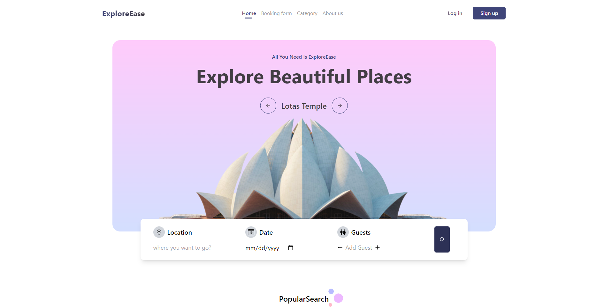
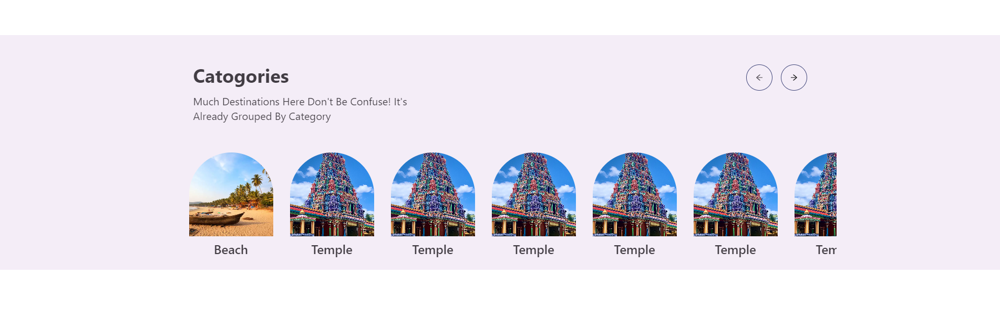
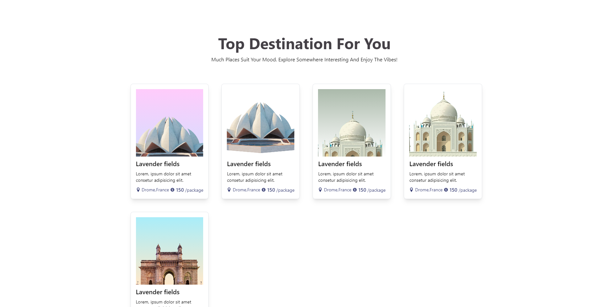
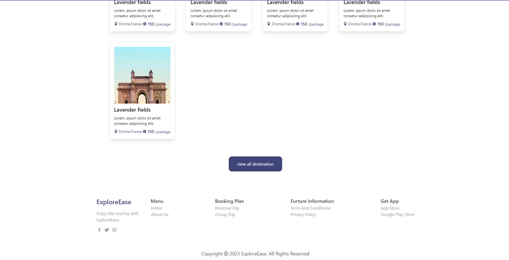

# ExploreEase

##### ExploreEase travel planner webapp where user can plan their whole tour.
Created in React js and tailwind css with react framer motion and react-icons.


## Run Locally

Clone the project

```bash
  git clone https://github.com/TechisHeaven/explore-ease.git
```

Go to the project directory

```bash
  cd my-project
```

Install dependencies

```bash
  npm install
```

Start the server

```bash
  npm run dev
```


## Screenshots






